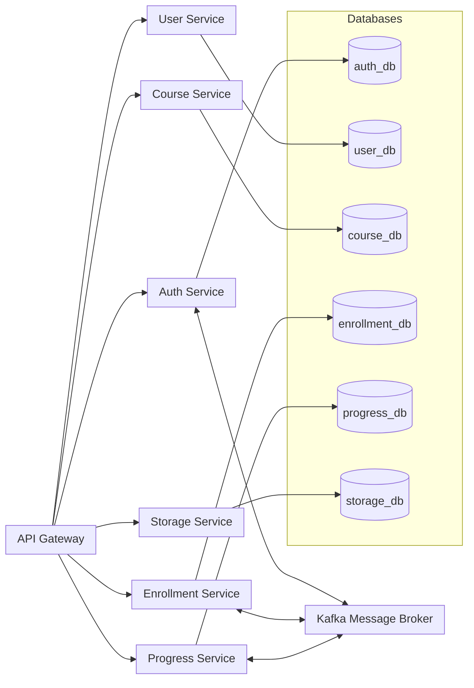

# 🎓 E-Learning Portal – Microservices Architecture

## 🧩 Overview

**E-Learning Portal** is an online learning system developed using **Microservices Architecture** to provide a flexible, scalable, and maintainable learning platform.  
The project is built with **Spring Boot** for the backend and can be integrated with **React / Next.js** for the frontend.

Each **microservice** handles a specific function and communicates via **API Gateway** or **Kafka message bus**.

---

## 🏗️ Project Structure

```bash
E_Learning/
├── api-gateway/          # Central gateway - routing, request authentication
├── auth-service/         # User authentication (JWT, OAuth2)
├── user-service/         # User profile and role management
├── course-service/       # Course and lecture management
├── enrollment-service/   # Course enrollment and registration
├── progress-service/     # Learning progress tracking
├── storage-service/      # Learning material storage (video, PDF, images)
└── README.md             # Project documentation
```

---

## 🧱 System Architecture (Mermaid Diagram)



---

## ⚙️ Technology Stack

| Component                | Technology              |
|--------------------------|-------------------------|
| **Primary Language**     | Java 17                 |
| **Framework**            | Spring Boot 3.x         |
| **API Gateway**          | Spring Cloud Gateway    |
| **Service Discovery**    | Netflix Eureka          |
| **Configuration Server** | Spring Cloud Config     |
| **Database**             | PostgresSQL / MySQL     |
| **Message Broker**       | Apache Kafka            |
| **Cache / Session**      | Redis                   |
| **Authentication**       | JWT + OAuth2            |
| **Build Tool**           | Maven                   |
| **Containerization**     | Docker & Docker Compose |
| **Frontend (optional)**  | React / Next.js         |

---

## 🚀 Getting Started

### 1️⃣ Prerequisites

* JDK 17+
* Maven 3.8+
* Docker & Docker Compose
* Redis & Kafka (can be run with Docker)

---

### 2️⃣ Clone the Project

```bash
git clone https://github.com/<your-username>/E_Learning.git
cd E_Learning
```

---

### 3️⃣ Configure Environment Files for Each Service

Example `auth-service/src/main/resources/application.yml`:

```yaml
spring:
  datasource:
    url: jdbc:postgresql://localhost:5432/auth_db
    username: postgres
    password: 123456
  jpa:
    hibernate:
      ddl-auto: update
server:
  port: 8081

jwt:
  secret: my-secret-key
  expiration: 3600000
```

---

### 4️⃣ Build & Run the Entire System

```bash
mvn clean package -DskipTests
docker-compose up --build
```

> 💡 You can create a `docker-compose.yml` file to run the entire system with a single command.

---

## 📡 API Gateway Routes

| Route                 | Service            | Description                          |
|-----------------------|--------------------|--------------------------------------|
| `/api/auth/**`        | auth-service       | Login, registration, refresh token   |
| `/api/users/**`       | user-service       | User management                      |
| `/api/courses/**`     | course-service     | Course list and details              |
| `/api/enrollments/**` | enrollment-service | Course enrollment                    |
| `/api/progress/**`    | progress-service   | Learning progress tracking           |
| `/api/storage/**`     | storage-service    | Upload / download learning materials |

---

## 🧠 Key Features

* ✅ **Registration / Login** (JWT, OAuth2)
* 👩‍🏫 **Course Management** (CRUD, categorization)
* 🧾 **Student Enrollment** and learning progress management
* 🧍 **User Management** and authorization (Admin / Instructor / Student)
* 📁 **Learning Resource Storage** (video, PDF, documents)
* 📊 **Dashboard with statistics and real-time notifications**

---

## 🧭 Design Principles

* Each **microservice has its own separate database** (Database per Service)
* Services communicate via:
    * **REST API** (synchronous)
    * **Kafka message bus** (asynchronous)
* Integration:
    * **Spring Cloud Config** → Centralized configuration management
    * **Eureka Discovery Server** → Automatic service registration and discovery
    * **API Gateway** → Routing, Auth filter, Rate limiting
* Follows **Clean Architecture + DDD (Domain-Driven Design)** principles

---

## 🧩 Future Enhancements

* 🧠 Add **Notification Service** (WebSocket / Kafka)
* 📈 Integrate **Monitoring** with Prometheus + Grafana
* 🔐 Integrate **Keycloak** for advanced OAuth2
* ☁️ Deploy on **Kubernetes / Docker Swarm**
* 🧮 Add **Search Service** (ElasticSearch)

---

## 👨‍💻 Development Team

| Role                    | Member |
|-------------------------|--------|
| Backend Developer       | *...*  |
| Frontend Developer      | *...*  |
| DevOps / Infrastructure | *...*  |

---

## 🧾 License

This project is developed for **educational and research purposes**.
© 2025 **E-Learning Team**. All rights reserved.